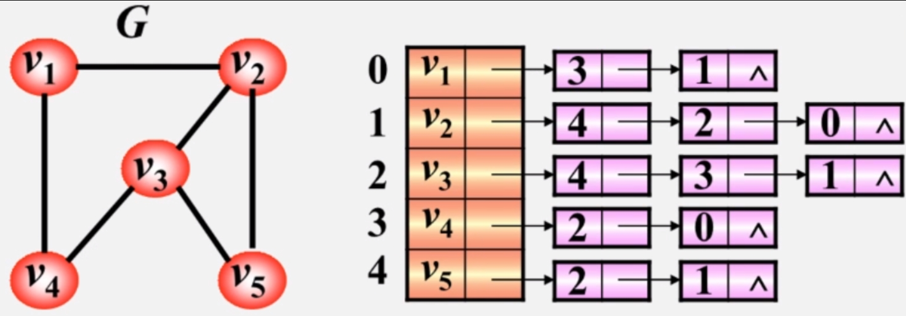

# 最小生成树

## Kruskal

步骤：<br>
* 按照权值大小将边排序并保存到数组V中
* 遍历V,连接节点
* 判断是否有环路，如果有舍去，反之保留
* 直到全部节点被连接

## Prim

步骤：<br>
* 指定一个节点，设为selected
* 将selected和no selected的分别作为两个整体
* 从selected到no selected选择权值最小的边，并将节点计入到selected
* 过程中不可以出现环
* 直到节点全部被连接

# 树的存储结构

* 双亲表示法
```C++
//parent = -1表示无双亲
template<class DataType>
struct PNode{
    DataType Data;
    int parent;
}
```
* 带右兄弟的双亲表示法
```C++
//parent = -1表示无双亲,rightsib = -1表示无右兄弟
template<class DataType>
struct PNode{
    DataType Data;
    int parent;
    int rightsib;
}
```
* 孩子表示法
```C++
struct CTNode{
    int Child;
    CTNode *Next;
}
template <Class DataType>
struct CBNode{
    DataType Data;
    CTNode *FirstChild;
}

vector<CBNode<int>>v;
//只表示孩子
```
* 双亲孩子表示法
* 孩子兄弟表示法

| firstchild | data | rightsib |
| ---- | ---- | ----- |

# 普通树的性质

* 树的结点数等于所有结点度数和加一
* 树的路径长度是从根到每个结点的路径长度之和

# 二叉树性质

* $n_0 = n_2+1$

# 完全二叉树

* $k=\lfloor log_2n \rfloor +1$
* 编号为 $i$ 的双亲编号 $\lfloor i/2 \rfloor$
* 编号为 $i$ 的左孩子编号 $2i$

# 二叉树的存储方式

* 顺序存储，使用数组保存二叉树的满二叉树形式
* 链式存储，`lchild data rchild`
* 三叉链表，`lchild data rchild parent`
* 线索链表，`ltag lchild data rchild rtag` tag=0指向孩子否则指向前驱或后继

```Cpp
//枚举
enum class flag{
    Child,Thread
};
//定义节点
template <class DataType>
struct ThrNode{
    DataType data;
    ThrNode<DataType> *lchild,*rchild;
    flag ltag,rtag;
};
//先建立二叉链表
template <class DataType>
ThrNode<DataType>* Creat(ThrNode<DataType>*bt){
    cin>>ch;
    if(ch=='#')bt=NULL;
    else{
        bt = new ThrNode;bt->data = ch;
        bt->ltag = 0;bt->rtag = 0;
        bt->lchild = Creat(bt->lchild);
        bt->rchild = Creat(bt->rchild);
    }
    return bt;
}
//中序线索化链表
template <class DataType>
ThrNode<DataType>* InitThrBiTree(ThrNode<DataType>*bt){
//
}
```

# （二叉树）的前序遍历和后序遍历

* 当前序遍历XY后续遍历YX一定有X是Y的父亲结点


# 哈夫曼树

* 前缀码：定义：在一个字符集中，任何一个字符编码都不是另一个字符编码的前缀。
* WPL（加权路径长度）：WPL 的值通常用来评估哈夫曼编码的效率，因为它反映了字符编码的平均位数。较低的 WPL 表示较短的编码长度，从而更有效地表示字符。

# AOE网络关键路径

* `事件最早发生时间ve`：按拓扑排序顺序遍历求值，当前结点为i,i.pre为i的前缀节点，VE(源点)=0，VE(i)=max(i.pre+path)
* `事件最晚发生时间vl`：按逆拓扑排序顺序遍历求值，当前结点为i,i.next为i的后缀节点，VL(源点)=VE(源点),VL(汇点)=VE(汇点)，VE(i)=min(i.next-path)
* `活动最早开始时间e`：e=边始点的最早发生时间ve
* `活动最晚开始时间l`：边终点的vl-path
* `全部关键路径`：保留在e=l的边，以箭头的方向为顺序排列边即可得到，在有多个关键路径时只有同时减少多个关键路径共有边才可缩短工期。
* `活动的时间余量`：边终点的VL-边始点的VE-path

# Dijkstra 最短路径
步骤<br>
* 起点为0并更新后继所有结点，起点加入集合S
* 选择已更新结点中最小加入集合S并更新最小节点后继

# 邻接表

* AOV的拓扑排序：时间复杂度O(n+e)

步骤：<br>
1. 先遍历一次节点数组，将入度为0的添加的栈顶
2. 栈非空，输出栈顶元素。并记录输出结点个数count，循环2-3
3. 遍历该节点对应的边，使终点结点入度减一，如果结点入度为零则添加到栈
4. 如果count<结点数则有回路

# 邻接表的定义

```C++

typedef struct VNode
{
	VerTexType data;         //顶点信息
	ArcNode *firstarc;       //指向第一条依附该顶点的边的指针
}VNode,AdjList[MVNum];

#define MVNum 100                //最大顶点数
typedef struct ArcNode           //边结点
{
	int adjvex;                  //该边所指向的顶点的位置
	struct ArcNode *nextarc;     //指向下一条边的指针
	OtherInfo info;              //和边相关的信息(权值等)
}ArcNode;

typedef struct
{
	AdjList vertices;      //存放各个顶点的数组
	int vexnum, arcnum;    //图的当前顶点数和弧数
}ALGraph;

```

# 邻接矩阵


# 常用公式

* 给定有序数组n个数据用二分法查找最多比较次数：$\lceil \log _2(n+1) \rceil$
* 给定二叉树先序序列可有$\frac{1}{n+1}C_{2n}^n$个对应树

# 算法

* 二叉树中可以成为折半查找判定树的是二叉排序树且中序序列是有序的
* 平衡二叉树中序遍历可以升序也可以降序。
* 平衡二叉树中最后插入的元素也不一定会是叶节点。
* 平衡二叉树中最小或最大的元素也可能不是叶节点。
* 平衡二叉树T1中删除v结点T2在插入v结点T3，不论v是叶节点还是分支结点，T1和T3可能相同也可能不同。原因就是有平衡调整。
* 二叉排序树T1中删除v结点T2在插入v结点T3，v是叶子结点T1=T3。v是分支结点T1与T3不同

# 散列表

* 除数余数法：假定散列表表长为m，取质数p不大于m且最大。

# Sort

# 希尔排序
----------
希尔排序的主要思想：插入排序对于比较有序的数列具有较好的性能<br>
通过改变部分数组序列的有序性来提高后面排序的性能
```C++
	template<class Elem>
	template<class _RanIt, class _Pr>
	inline void X_Sort<Elem>::X_Sort_Shell(const _RanIt _First, const _RanIt _Last, _Pr _Pred)
	{
		tl size = _Last - _First;
		tl gap = size / 2;
		while (gap > 0) {							//间隔数到1时就是整个数组排序
			for (tl i = gap; i < size; ++i) {		//对每一个元素进行插入排序，这里不是每个子序列分别排序。
				for (tl j = i; j >= gap && _Pred(*(_First + j - gap), *(_First + j)); j -= gap) {//该元素的插入排序
					X_std::swap(*(_First + j - gap), *(_First + j));
				}
			}
			gap /= 2;
		}
	}
```
> 这里解释一下while内部的两个循环的作用。两个循环就是将所有的以gap为间隔的子序列进行排序
，但是这里并没有显式的分别对子序列排序，而是采用了混合排序。如下标：<br>
0,1,2,3,4,5,6,7,8,9 <br>
假如gap=2分组如下:<br>
0,2,4,6,8 ;;1,3,5,7,9<br>
正常分子序列排序需要分别从2，3开始排序，（1，3为插入排序未排序部分开头），一直遍历到最后，
如果我们从2开始让2进行插入排序，这个时候可以对4进行排序了，但是我们在中间插入个对3排序
这也不影响对4排序。就是这么个过程。
# C++ 标准排序算法实现
----------
在C++标准库中，std::sort使用的是一种混合的排序算法，通常称为introsort（内省排序）。
<span style = "color : pink">introsort是一种结合了快速排序（quicksort）、堆排序（heapsort）和插入排序（insertion sort）的排序算法。
</span> std::sort会根据输入数据的大小和递归深度来选择合适的排序策略，以提供高效的排序性能。<br>

具体来说，当数组的大小较小时，std::sort会使用插入排序（insertion sort）来进行排序，因为插入排序在小规模数据上表现优秀。当递归深度超过一定阈值时，
为了避免快速排序的最坏情况（当数据近乎有序时快速排序性能下降较严重），
std::sort会切换到堆排序（heapsort）来保证排序性能的稳定性。
而对于大规模数据和适度深度的递归，std::sort会使用快速排序（quicksort），因为快速排序通常在平均情况下具有较好的性能。<br>

总的来说，std::sort使用introsort算法来获得快速排序、堆排序和插入排序的优点，以在不同情况下提供高效的排序性能。
introsort是一种通用且高效的排序算法，是C++标准库中std::sort的默认排序算法。<br>
# 归并排序代码解析
-----------
```C++
	template<class Elem>
	template<class _RanIt, class _Pr>
	inline void X_Sort<Elem>::X_Sort_Merge(const _RanIt _First, const _RanIt _Last, _Pr _Pred)
	{
		tl size = _Last - _First;//子序列大小
		if (size <= 1)return;//当子序列大小为1时我们就不用再对他分左右排序了
		_RanIt _Middle = _First + (size / 2);//找到中间值
		X_Sort_Merge(_First, _Middle, _Pred);//这是一个[_First,_Middle),这里的_Middle相当于end迭代器,他是结束标识不参与排序
		X_Sort_Merge(_Middle , _Last, _Pred);//这是一个[_Middle,_Last),这里的_Last相当于end迭代器

		X_Merge(_First, _Middle, _Last, _Pred);//对上面排好序的俩个子序列归并
	}
```
值得注意的是，在归并两个有序的子序列，哪个子序列先被遍历完是不确定的，尽管某个子序列较长他也可能被先遍历完
# 快速排序
-----------

快速的基本思想：冒泡排序
 
从待排序列随机取一个数作为基准，定义左右指针将右边的小于（大于）基准的数放到左边，
将左边的大于（小于）基准的数放到右边，最后在左右指针相遇的地方就是基准确定的位置。
然后在为基准左右子序列分别排序直到子序列大小为1为止。

# 堆排序
-----------

堆排序基本思想：选择排序

每次将最大或最小的元素放到root
排序时将root元素与最后的元素交换位置，最后面的就是有序序列，交换位置后有序序列多一位，
堆排序每次从无序序列中选择以为放到有序序列。

对于堆的插入和删除：
插入：就将新元素放到数组最后面，然后将新元素到root路径上的所有元素排序，
删除：就将末尾元素放到被删除的位置，然后做heapfy操作。
# 桶排序，计数排序，基数排序
------------
这三个排序算法思想较为一致
* 桶排序：需要事先知道元素范围，分为多个均匀的桶，每个桶一个范围区间。先将元素按桶分组，
  然后对每个桶内的元素排序（这里的算法任选），最后按顺序输出。
* 计数排序：同桶排序类似，将桶的个数分为不可再分为止，每个桶的范围只是一个确定的元素值，
  将元素按桶分好，按序输出即可
* 基数排序：共0~9十个桶，所有元素从个位开始一直到最高位开始循环，每一位都按桶分组后输出，
  直到最高位分组后输出即为结果。