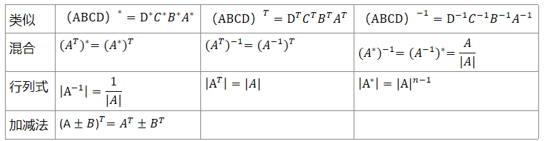

# 俩个重要极限

* $$\lim _{x->0} \frac{\sin x}{x} = 1~~~~\lim _{x->\infty}(1+\frac{1}{x})^x = e $$

# 泰勒&等价无穷小

$$
\begin{aligned}
&泰勒公式 \\
&\ln(1+x)=x-\frac{x^2}{2}+\frac{x^3}{3}-\frac{x^4}{4}+(-1)^n\frac{x^{n+1}}{n+1}+o(x^{n+1}) \\
&(1+x)^a = 1+ax+\frac{a(a-1)}{2!}x^2+···+\frac{a(a-1)···(a-n+1)}{n!}x^n+o(x^n) \\
&\tan x = x + \frac{1}{3}x^3+···
\end{aligned}
$$

$$
\begin{aligned}
    &\ln (1+x) \sim x \\
    &e^x-1 \sim x \\
    &\log _a(1+x) \sim \frac{x}{\ln a} \\
    &(1+⭐)^a-1 \sim a⭐ \\
    &1-(1-⭐)^a \sim a⭐ \\
\end{aligned}
$$

# 积分

$$
\begin{aligned}
    &\int \tan x dx = -\ln |cosx|+C \\
    &\int \cot x dx = \ln |sinx|+C \\
    &\int \sec x dx = \ln |secx + tanx|+C \\
    &\int \csc x dx = \ln |cscx - cotx|+C \\
    &\int \frac{dx}{a^2+x^2} = \frac{1}{a} \arctan \frac{x}{a}+C \\
    &\int \frac{dx}{x^2-a^2} = \frac{1}{2a}\ln |\frac{x-a}{x+a}|+C \\
    &\int \frac{dx}{\sqrt{a^2-x^2}} = \arcsin \frac{x}{a}+C \\
    &\int \frac{dx}{\sqrt{a^2+x^2}} = \ln (x+\sqrt{x^2+a^2})+C \\
    &\int \frac{dx}{\sqrt{x^2-a^2}} = \ln |x-\sqrt{x^2-a^2}|+C \\

\end{aligned}
$$

# 极限类型

* $1^\infty$ 型 化为 $\lim _{x->\infty}(1+f(x))^{g(x)}$ 求$\lim _{x->\infty}g(x)f(x)$ 结果$e^{\lim _{x->\infty}g(x)f(x)}$
* 极限时可以算出来的非零因数就算出来，算出含有x的表达式也可以只要不是零
* 遇到$f(g(x))-f(w(x))$这样的表达式可以使用拉格朗日中值定理$f'(c) = (f(b)-f(a))/(b-a)$
# 微分方程

一阶线性齐次微分方程 $y'+P(x)y=0$

$$
\begin{aligned}
    y=Ce^{-\int P(x) dx}
\end{aligned}
$$

一阶线性非齐次微分方程 $y'+P(x)y=Q(x)$

$$
\begin{aligned}
    y=e^{-\int P(x) dx}(C+\int Q(x) e^{\int P(x) dx}dx)
\end{aligned}
$$

# 施密特正交化

$$

\begin{aligned}

&\beta _1 = \alpha _1 \\

&\beta _2 = \alpha _2 - \frac{(\alpha _2,\beta _1)}{(\beta _1,\beta _1)}\beta _1 \\
\end{aligned}

$$

# 秩

* 一个矩阵的秩等于其列向量组中线性无关的列向量的最大数量
* 矩阵的秩等于其列空间的维度等于行空间维度（与第一条类似）
* 满秩则可逆
* r阶子式不为零，r+1阶子式全为零
* 非零矩阵秩一定大于1
* 增广矩阵秩一定不小于原矩阵秩
* $r(A+B)<=r(A)+r(B)$
* $r(AB)<=\min (r(A),r(B))$
* $r(kA)=r(A)$
* n阶方阵A和B，AB=0则$r(A)+r(B)<=n$
# 特征值

* 一个n阶方阵一定有n个特征值，但特征值可以是重根
* 属于不同特征值的特征向量一定线性无关
* 特征值相乘等于行列式
* 特征值相加等于矩阵迹
* 矩阵可逆的充要条件是特征值全不为零
* $\lambda 是 A 的特征值，f(\lambda) 是 f(A) 的特征值$

# 相似矩阵

* 相似矩阵的 行列式，秩，可逆性，特征值相同。
* 矩阵相似于对角化充要条件：有N个线性无关的特征向量

# 可逆矩阵

* 矩阵的特征向量是线性无关的
* 矩阵的特征值都不为零
* 矩阵的特征向量可以用来构建矩阵的逆 A⁻¹ = P * Λ⁻¹ * P⁻¹

# 实对称矩阵

* 实对称矩阵对应于不同特征值的特征向量一定正交
* 实对称矩阵一定可以相似于对角型，也就是说一定有N个线性无关的特征向量

# 正交矩阵

* 列向量是单位向量且两两正交
* $Q^T Q = E$
* 正交矩阵的行列式的绝对值为 1
* 单位矩阵也是正交矩阵
* 交换两行的单位矩阵也是正交矩阵

# 正定矩阵

* 特征值决定它的正定性

# 合同矩阵

* $A = P^T B P$
* 两个矩阵有相同的正惯性指数和负惯性指数

# 等价矩阵

* 一个矩阵经过一系列初等变换
* 具有相同的秩，相同的行空间。
* 不同的特征值和特征向量
* 不同的行列式

# 齐次方程解的存在

* Ax=0有非零解，|A|=0，A不满秩
* Ax=0只有零解，|A|!=0，A满秩
* 值得注意的是Ax=0其中的x不是我们简单的一个值，而是一个个向量，这些向量可以组成矩阵例如 AB=0

# 分块矩阵

* 加，减，乘，数乘，与自己杜撰的算法一致
* 转置对大矩阵转置块矩阵也转置
* 求逆
$$
\begin{pmatrix}
A & 0 \\
0 & B \\
\end{pmatrix}^{-1} = 
\begin{pmatrix}
    A^{-1} & 0 \\
    0 & B^{-1}
\end{pmatrix} \\

\begin{pmatrix}
0 & A \\
B & 0 \\
\end{pmatrix}^{-1} = 
\begin{pmatrix}
    0 & B^{-1} \\
    A^{-1} & 0
\end{pmatrix} \\

\begin{pmatrix}
A & 0 \\
E & B \\
\end{pmatrix}^{-1} = 
\begin{pmatrix}
    A^{-1} & 0 \\
    0 & B^{-1}
\end{pmatrix} \\

\begin{pmatrix}
    A & E \\
    0 & B \\
\end{pmatrix}^{-1} =
\begin{pmatrix}
    A^{-1} & -A^{-1}EB^{-1} \\
    0 & B^{-1}
\end{pmatrix} \\

\begin{pmatrix}
    A & \\
      & B & \\
      &   & C\\
\end{pmatrix}^{-1} =
\begin{pmatrix}
    A^{-1} & \\
      & B^{-1} & \\
      &   & C^{-1} \\
\end{pmatrix}
$$

# 特别理解

* $\alpha 是非零列向量则 \alpha \alpha^T一定是非零对称矩阵$
* $A^3=0说明A^3的特征值为0$，矩阵经过一定的运算特征值也做同样的运算，所以A的特征值也是0
* 变限定积分与x的无穷小比较。$\int ^{g(x)} _0f(t)dt$,f(x)是x的n阶无穷小，g(x)是x的m阶无穷小。则原式是x的m(n+1)阶无穷小
* 函数具有一阶连续导数那么原函数平滑且连续
* 向量可以线性表出通常可以理解为方程组有解
* 对称定积分在加法中如果有奇函数则该项为0

# 草稿
$$
\begin{aligned}
    \lim _{d->0} \frac{f(a+d)-f(a-d)}{d}存在但是不能推出f'(a)存在，f(x)可能在x=a处无定义
\end{aligned}

$$

vscode 更改