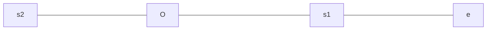

## 电场
_________
$$

\begin{aligned}
& 高斯定理 :\int _S Eds = \frac{Q}{ \varepsilon }[Q是自由电荷和极化电荷的总量]\\
& k=\frac{1}{4\pi \varepsilon}\\
& 薄层电荷对一侧：E=\frac{\delta}{2\varepsilon}\\
& 厚层电荷对一侧：E=\frac{\delta}{\varepsilon}\\
& 电位移：D=\varepsilon_r E\\
& 在一定程度上可以说D=\delta
& 所以高斯定理可写：\int_s Dds=\sum q_0[q_0是自由电荷]\\

\end{aligned}
$$

## 磁场
________

$$

\begin{aligned}
& k =\frac{\mu}{4 \pi}\\
& 磁矩: P_m=nI_0\Delta S
\end{aligned}

$$
## 振动
______
##### 相位与振幅
$$
A=\sqrt{x_0^2+(\frac{v_0}{\omega})^2}\\
A=\sqrt{A_1^2+A_2^2+2A_1A_2\cos(\varphi_2-\varphi_1)}\\
\tan \varphi=\frac{A_1\sin \varphi_1+A_2\sin \varphi_2}{A_1\cos \varphi_1+A_2\cos \varphi_2}
$$
## 简谐波的波函数
----
##### 波函数推导
在波源处在 t 时刻有振动方程
$$
y=Acos(\omega t-\phi)
$$
假设波源在坐标原点处，由于波在某种介质中传播并且速率为u,那么如果在x轴上有一个点p，距离波源距离为x，那么从波源传播到p点需要的时间为$\Delta t=\frac{x}{u}$
那在时间这一方面：在p点的质点运动将比o点的运动晚$\Delta t$的时长 (也就是说p点在$\Delta t$时刻所具有的运动状态)
也就是图像沿着x轴右移$\Delta t$个单位
$$
\begin{aligned}
   y&=Acos[\omega (t-\Delta t)+\phi]\\
   &=Acos[\omega (t-\frac{x}{u})+\phi]
\end{aligned}
$$
##### 波的波函数物理意义
最常见的就是时间与相位差的关系以及空间与相位差的关系
$$
\Delta \phi =-\frac{2\pi}{\lambda}(x_2-x_1)
$$
这里因为$x_2$在$x_1$后面，就是说当波传播到$x_1$以后才会继续传播到$x_2$，那$x_2$的相位就应该小于$x_1$,那么$\Delta \phi \lt 0$而$x_2-x_1\gt 0$所以有负号。
$$\Delta \phi = \frac{2\pi}{T}(t_2-t_1)$$
[^_^]:这是注释耶
[>_>]:我去
[<_>]:好可爱的注释
[>_<]:我最可爱
##### 波速与振速
- $\color{red}{波速:}$
  $u=\frac{\mathrm{d}x}{\mathrm{d}t}
$
- $\color{red}{振速:}$$v=\frac{\mathrm{d}y}{\mathrm{d}t}$
*相位圆是任意时刻的的相位圆，并不只是 t=0 时刻的*
##### 简谐振动能量与波函数能量,能流与能流密度
- 简谐振动
$$\begin{aligned}
    E_k=E-E_p
\end{aligned}$$ 
$$
\begin{aligned}
E&=\frac{1}{2}mV_m^2
=\frac{1}{2}mw^2A^2
\end{aligned}
$$
- 波函数
1. $\color{blue}{波的能量密度}$
   看作一点的实时的能量{能量的生产速度}
2.   $\color{blue}{波的平均能量密度}$
   看作一点的一周期的平均能量，单位体积介质在一个周期里所具有的能量P{用于描绘能量的生产速度}
  $$
  \begin{aligned}
      w=\frac{1}{2}\rho \omega^2 A^2
  \end{aligned}
  $$

3. $\color{blue}{波的能流密度}$
   $I=\bar{w}u$
4. $\color{blue}{波的能流}$
   也就是单位时间通过某一界面的能量下面的公式是平均能流
   $\bar{p}=\bar{w}v\Delta S$
##### 波的能量和能量密度
波函数
$y=Acos[(\omega t-\frac{x}{u})+\phi]$
波的振速
$v=\frac{\partial y}{\partial t}=-A\omega sin[(\omega t-\frac{x}{t})+\phi]  $
波的实时的动能
$E_k=\frac{1}{2}(dm)v^2$,dm=$\rho$dv
$dE_k=\frac{}{}$
##### 波的吸收
$I=I_0e^{-2\alpha x}$
表示介质中x位置的波强
##### 波的干涉
**波的频率，振动方向，恒定的相位差**
$$
\begin{aligned}
   &\Delta \phi=(\phi_2-\phi_1)-\frac{2\pi}{\lambda}(r_2-r_1)\\
   &上面的公式相当重要\\
   &A^2=A_1^2+A_2^2+2A_1A_2cos(\Delta \phi)\\
   &I=\frac{1}{2}\rho A^2 \omega^2u\\
   &I=I_1+I_2+2\sqrt{I_1I_2}cos(\Delta \phi)
\end{aligned}
$$

假设在O与s1处有俩相干波源振幅A，O与s1距离为$\frac{\lambda}{4}$,O的相位超前于s1的相位$\frac{\pi}{2}$
$$
\begin{aligned}
   &设O的相位为\phi_1=\phi所以S_1的相位为\phi_2=\phi-\frac{\pi}{2}\\
   &设S_2到O的距离为r_1\\
   &O,S_1传到S_2的相位差为\Delta \phi=(\phi_1-\phi_2)-\frac{2\pi}{\lambda}(r_1-(r_1+\frac{\lambda}{4}))\\
   &\Delta \phi=\pi\\
   &\therefore A=|A_1-A_2|=0,I=0
\end{aligned}
$$

## 狭义相对论
-----------
$$
\begin{aligned}
&x'=\frac{x-ut}{\sqrt{1-\frac{u^2}{c^2}}}\\
&t'=\frac{t-\frac{ux}{c^2}}{\sqrt{1-\frac{u^2}{c^2}}}\\
&v_x'=\frac{v_x-u}{1-\frac{v_xu}{c^2}}\\
&v_y'=\frac{v_y\sqrt{1-\frac{v_x^2}{c^2}}}{1-\frac{v_xu}{c^2}}
\end{aligned}
$$

## 热力学
-------
每一个自由度上的动能为(以x轴为例)$\frac{1}{2}mv_x^2=\frac{1}{2}\mathrm{kT}$
$\bar{\omega}是一个气体分子的平动动能\bar{\omega}=\frac{1}{2}mv^2=\frac{3}{2}\mathrm{k}\mathrm{T}$
$气体压强p=nkT=n\frac{2}{3}\bar{\omega}$，这是气体压强与分子平动动能关系
$1mol气体的内能E=E_0N,E_0=\frac{i}{2}\mathrm{RT}$
$气体能量：E=\frac{\mathrm{i}}{2}\mathrm{pv}$
***分子速率的三个统计值***
1. 方均根速率(平动动能得到的速度)(m是一个分子的质量)
$\frac{1}{2}m\bar{v^2}=\frac{3}{2}kT,\sqrt{\bar{v^2}}=\sqrt{\frac{3kT}{m}}=\sqrt{\frac{3RT}{mN_A}}=\sqrt{\frac{3RT}{M_{mol}}}$
2. 最概然速率
$v_p=\sqrt{\frac{2RT}{M_{mol}}}$
3. 平均速率
$\bar{v}=\sqrt{\frac{8RT}{\pi M_{mol}}}$

### 气体
________________
$$
\Delta Q=\frac{M}{M_{mol}}C_{v,m}\Delta T
$$

&nbsp;&nbsp;&nbsp;&nbsp; 说到创新，爱因斯坦无异于是最具创新性的科学家。

爱因斯坦出生于德国乌尔姆市的一个犹太人家庭（父母均为犹太人）。1900年毕业于瑞士苏黎世联邦理工学院，入瑞士国籍   。1905年，爱因斯坦获苏黎世大学物理学博士学位，并提出光子假设、成功解释了光电效应（因此获得1921年诺贝尔物理奖）  ；同年创立狭义相对论，1915年创立广义相对论，1933年移居美国、在普林斯顿高等研究院任职，1940年加入美国国籍同时保留瑞士国籍   。1955年4月18日，爱因斯坦于美国新泽西州普林斯顿逝世，享年76岁
对于相对论来说爱因斯坦将各种不同的成果（牛顿、法拉第、麦克斯韦、洛伦兹、庞加莱等人取得的成就）通通纳入一个基本的相对论假设，为重新定义空间、时间和物理世界的其他概念打下坚实的基础。从此我们将以截然不同的观点，看待空间和时间、物质和能量。这次创新很难让人接受，但却是最成功的。
1905年9月德国的《物理杂志》发表了爱因斯坦的《论动体的电动力学》论文，标志着爱因斯坦创立了狭义相对论，使电磁场理论和经典力学得到了统一，开创了物理学的新纪元。观看这照亮世界的物理学，深感狭义相对论是爱因斯坦科学创新的精美楷范。
