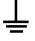
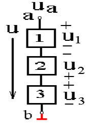

# 电工电子技术
**1.** **电路**：
* 电源（其他形式能转换为电能）
* 负载
* 中间环节：（传输，分配，控制电能）
* 电路：用来传递或转换电能。用来实现信息的传递和处理。
$$
电流定义式：I=\frac{Q}{t}\\
微分式：i=\frac{dq}{dt}
$$
#### 电位
参考电位为0（V伏特）
1. <i>选大地</i> 
2. <i>选元件汇集的公共端</i> 
#### 电压
俩点电位之差
电压的方向：高电位指向低电位
#### 电动势
电源的外力把单位正电荷由负极移动到正极(非电场力做功)
#### 功率
$$
p=\frac{W}{t}\\
微分式不写了\\
p=EI(电源输出功率)\\
p=UI（负载的功率）
$$
#### 电能
$
1千瓦时=3.6\times 10^6J（焦耳）
$
公式：略
#### 额定电压功率
#### 几道小学题
***短路特点***
1. 短路处的电压等于零
2. 短路处的电流应视电路情况而定

[>_<]: 以上是初中的东西，没必要做笔记

## 参考方向
***电压、电流及电动势的实际方向***
(1) 电流的实际方向 
规定正电荷移动的方向为电流的实际方向。 
(2) 电压的实际方向 
 规定由高电位端指向低电位端为电压的实际方向。
是电位降低的方向。降正升负.
(3) 电动势的实际方向 
 规定为在电源内部由低电位指向高电位。
***参考方向***
* 如果计算结果为正，则实际的方向与参考方向相同。
* 极性+ -正指向负
* 双下标：$U_{ab}(a\rightarrow b)$
* 箭头

正对正(电流正入负出)即为关联$$
I=\frac{U}{R}\\
P=UI如果正的就是吸收功率（负载）否者就是发出功率（电源）
$$
否则非关联$I=-\frac{U}{R}$

<!-- A类 |B类|C类
----|---|----
dog|    |df -->